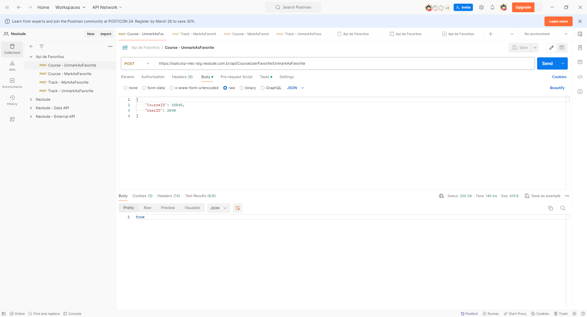

## Validação de API para Marcar/Desmarcar Conteudo como favorito

### Demonstração
Para acessar a demonstração do projeto <a href="https://qa-presentation.postman.co/workspace/Neolude~abb46f74-ed45-4a39-980d-a1ec903c33a2/collection/5351779-9df0b825-22c7-4123-b09a-11e5388fc07b?action=share&creator=5351779" target="_blank">Clique aqui</a>

### Introdução:
Este projeto apresenta a validação da API para a funcionalidade de marcar/desmarcar um curso como favorito. A validação foi realizada utilizando a ferramenta Postman, permitindo garantir a qualidade e confiabilidade da API antes de sua implementação em produção.

### Objetivo:
O objetivo principal do projeto era verificar se a API funcionava de acordo com os requisitos especificados e atendia às expectativas dos usuários. Para isso, foram criados quatro cenários de teste que abrangem as principais funcionalidades da API:
Cenários de Teste

### Resultados:
Todos os cenários de teste foram executados com sucesso, confirmando que a API funciona de acordo com os requisitos especificados. A validação identificou alguns pontos de melhoria, como a necessidade de mensagens de erro mais específicas, que foram documentados para posterior correção
